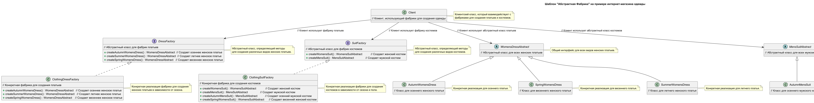

# Шаблон "Абстрактная Фабрика"

## Что это такое?

Шаблон "Абстрактная фабрика" предоставляет интерфейс для создания семейств взаимосвязанных объектов без указания их
конкретных классов. Это позволяет изолировать код, отвечающий за создание объектов, от кода, использующего эти объекты,
что делает систему более гибкой и удобной для изменения.

## Когда использовать?

- Когда необходимо создавать разные продукты, которые могут изменяться и развиваться.
- Когда нужно гарантировать, что созданные объекты будут совместимы друг с другом.
- Когда система должна оставаться независимой от конкретных классов создаваемых объектов.

## Как это работает?

### Компоненты:

1. **Фабрика:** Интерфейс, который определяет методы для создания продуктов.
2. **Конкретные фабрики:** Реализуют интерфейс фабрики и создают конкретные продукты.
3. **Абстрактные продукты:** Интерфейс для объектов, создаваемых фабрикой.
4. **Конкретные продукты:** Реализуют интерфейс абстрактных продуктов.

## Плюсы

- **Гибкость:** Упрощает изменение и расширение системы, так как новые продукты могут быть добавлены без изменения
  клиентского кода.
- **Совместимость:** Гарантирует, что созданные объекты будут совместимы друг с другом, что упрощает интеграцию.
- **Изоляция:** Разделяет код создания объектов от кода их использования, улучшая читаемость и поддержку.

## Минусы

- **Сложность:** Увеличивает количество классов и уровней абстракции, что может усложнить понимание системы.
- **Избыточность:** В некоторых случаях может быть избыточным, особенно если система не требует множества различных
  реализаций.
- **Увеличение времени разработки:** Необходимость создания дополнительных классов может увеличивать время на
  разработку.

## Почему это полезно?

- Упрощает изменение и расширение системы.
- Позволяет избежать жесткой зависимости от конкретных реализаций.
- Снижает сложность и улучшает читаемость кода.

## Структура




```
── AbstractFactory/
    ├── Client/
    │   └── Client.php                                # Клиент, который использует фабрики
    ├── Factories/
    │   ├── Contracts/
    │   │   ├── DressFactory.php                      # Интерфейс фабрики платьев
    │   │   └── SuitFactory.php                       # Интерфейс фабрики костюмов
    │   ├── ClothingDressFactory.php                  # Фабрика платьев для всех сезонов
    │   └── ClothingSuitFactory.php                   # Фабрика костюмов для всех сезонов
    ├── Products/
    │   ├── Mens/
    │   │   ├── Suits/
    │   │   │   ├── Contracts/
    │   │   │   │   └── MensSuitAbstract.php          # Абстрактный класс для мужских костюмов
    │   │   │   ├── AutumnMensSuit.php                # Осенний мужской костюм
    │   │   │   └── SpringMensSuit.php                # Весенний мужской костюм
    │   ├── Womens/
    │   │   ├── Dresses/
    │   │   │   ├── Contracts/
    │   │   │   │   └── WomensDressAbstract.php       # Абстрактный класс для женских платьев
    │   │   │   ├── AutumnWomensDress.php             # Осеннее женское платье
    │   │   │   ├── SpringWomensDress.php             # Весеннее женское платье
    │   │   │   └── SummerWomensDress.php             # Летнее женское платье
    │   │   └── Suits/
    │   │       ├── Contracts/
    │   │       │   └── WomensSuitAbstract.php        # Абстрактный класс для женских костюмов
    │   │       ├── AutumnWomensSuit.php              # Осенний женский костюм
    │   │       └── SpringWomensSuit.php              # Весенний женский костюм
    └── IndexController.php                           # Контроллер для обработки запросов (при необходимости)

```

## Применимость

- Система **не должна зависеть** от того, как создаются, компонуются и представляются входящие в неё объекты одежды.
- Система должна настраиваться **одним из семейств одежды** (например, осенние или весенние костюмы).
- Входящие в семейство взаимосвязанные объекты **спроектированы для совместной работы**, и необходимо обеспечить
  выполнение этого ограничения.
- Необходимо предоставить библиотеку объектов, раскрывая только их **интерфейсы**, но скрывая **реализацию**.

## Участники

- **ClothingFactory (Фабрика Одежды)**:
    - Объявляет интерфейс для операций, создающих абстрактные объекты-продукты одежды.

- **AutumnClothingFactory и SpringClothingFactory (Конкретные Фабрики)**:
    - Реализуют интерфейс `ClothingFactory`.
    - Создают конкретные объекты для каждого семейства одежды (осенние или весенние костюмы).

- **WomensSuit и MensSuit (Абстрактные Продукты)**:
    - Определяют интерфейсы для различных типов продуктов одежды (женские и мужские костюмы).

- **AutumnWomensSuit, SpringWomensSuit, AutumnMensSuit, SpringMensSuit (Конкретные Продукты)**:
    - Конкретные реализации продуктов, создаваемые соответствующими фабриками.

- **Client (Клиент)**:
    - Использует фабрики и продукты через абстрактные интерфейсы.

## Отношения

- Во время выполнения создается **единственная конкретная фабрика**, которая отвечает за создание объектов-продуктов
  одежды.
- `ClothingFactory` делегирует создание продуктов подклассам `AutumnClothingFactory` и `SpringClothingFactory`.

## Результаты

- **Изолирует конкретные классы**: Клиент взаимодействует только с абстракциями, не зная о конкретных классах, что
  упрощает изменение внутренней реализации.

- **Упрощает замену семейств продуктов**: Семейство продуктов можно заменить другим, изменив конкретную фабрику, не
  изменяя клиентский код.

- **Гарантирует сочетаемость продуктов**: Продукты одного семейства разработаны для совместной работы. Фабрика одежды
  гарантирует создание таких совместимых объектов.

- **Не упрощает задачу добавления новых типов продуктов**: Для добавления нового типа продукта требуется модифицировать
  интерфейс фабрики и все её реализации, что усложняет расширение системы.

## Реализация

- **ConcreteFactory** лучше реализовать через паттерн **Одиночка (Singleton)**, чтобы гарантировать создание только
  одной фабрики для каждого семейства одежды.

- Создание продуктов делегируется подклассам, часто реализуемое через паттерн **Фабричный метод (Factory Method)**, что
  позволяет конкретным фабрикам создавать продукты специфическим образом.

- Если существует множество семейств продуктов, конкретные фабрики можно реализовать с помощью паттерна **Прототип (
  Prototype)**, позволяющего клонировать продукты, избегая жесткого связывания с классами.

### Расширяемость

- Для добавления нового продукта нужно изменить интерфейс **ClothingFactory** и все её подклассы, что делает этот
  процесс трудоемким.

- Более гибкий подход — использовать единственный метод `make(type)` с параметром, указывающим тип создаваемого объекта.
  Это уменьшает количество операций, но увеличивает риск ошибок и сложность системы.

# Применение паттерна "Абстрактная Фабрика" в интернет-магазине

Паттерн "Абстрактная Фабрика" — это мощный инструмент, который оправдано применять в ряде сценариев в интернет-магазине,
особенно когда необходимо создавать и управлять группами связанных объектов или продуктов. Вот список типичных случаев,
когда его использование будет целесообразно и оправдано:

## 1. Фильтрация товаров по категориям и атрибутам

- **Категории товаров**: Если магазин предлагает несколько категорий товаров (например, одежда, обувь, аксессуары),
  абстрактная фабрика может инкапсулировать логику создания объектов для каждой категории.
- **Фильтрация по сезонам**: Как в вашем примере с одеждой, фабрики могут создавать разные объекты товаров (например,
  весенние, летние, осенние коллекции) на основе выбранного фильтра.
- **Фильтрация по другим атрибутам**: Например, размер, цвет, бренд, материал. Если у разных категорий товаров разные
  атрибуты, фабрика может создавать продукты, учитывая эти параметры.

## 2. Создание различных видов страниц товаров

- **Продукты по категориям**: Абстрактная фабрика может управлять созданием страниц для различных категорий товаров.
  Например, страницы для одежды и электроники будут отличаться по дизайну и структуре.
- **Продукты по брендам**: Если в магазине разные бренды товаров имеют уникальный стиль отображения, фабрика может
  создавать объекты страниц с уникальными шаблонами или компонентами.
- **Продукты по акциям и скидкам**: Разные товары, представленные в рамках акций или скидок, могут требовать отдельной
  визуализации или бизнес-логики.

## 3. Работа с корзиной товаров

- **Разные типы товаров в корзине**: Если товары в корзине требуют разной обработки (например, виртуальные товары или
  физические товары с различной логистикой), абстрактная фабрика может управлять созданием объектов для каждой
  категории.
- **Разные способы доставки и оплаты**: Фабрика может создавать объекты, представляющие различные стратегии доставки и
  оплаты, например, экспресс-доставка, самовывоз, оплата картой или криптовалютой.

## 4. Работа с платежными системами

- **Разные платежные методы**: Если интернет-магазин поддерживает разные методы оплаты (карты, PayPal, криптовалюты и т.
  д.), фабрика может управлять созданием объектов для работы с каждым типом платежной системы. Это может включать
  обработку запросов, проверку транзакций и генерацию отчетов по платежам.
- **Интеграции с разными платёжными шлюзами**: Абстрактная фабрика может управлять созданием объектов для работы с
  разными платежными провайдерами (Stripe, PayPal, банковские платежи), абстрагируя логику работы с каждым из них.

## 5. Работа с логистикой и доставкой

- **Создание объектов для разных типов доставки**: В зависимости от региона или типа товара, доставка может
  различаться (например, доставка почтой, курьером или самовывоз). Абстрактная фабрика может создавать объекты, которые
  управляют логикой расчета и обработки доставки для каждого типа.
- **Интеграции с логистическими системами**: Если ваш интернет-магазин интегрирован с несколькими курьерскими службами (
  например, DHL, UPS, FedEx), фабрика может создавать адаптеры для работы с каждой из систем доставки.

## 6. Персонализация контента

- **Персонализация под клиента**: Абстрактная фабрика может создавать разные типы интерфейсов для разных типов
  пользователей. Например, для VIP-клиентов или оптовых покупателей отображается уникальная версия сайта с
  персонализированными предложениями.
- **Персонализация под местоположение**: Различные фабрики могут создавать интерфейсы в зависимости от региона
  пользователя, поддерживая локализацию, валюты, языки и местные предпочтения.

## 7. Создание отчетности и аналитики

- **Разные типы отчетов**: В интернет-магазине могут требоваться отчеты разного типа — отчеты по продажам, по
  популярности товаров, по эффективности маркетинговых кампаний и т. д. Абстрактная фабрика может создавать объекты,
  которые собирают и выводят данные в нужных форматах (PDF, Excel и т. д.).
- **Отчеты по поставщикам**: Для работы с несколькими поставщиками фабрика может создавать объекты для генерации отчетов
  по каждому из них, учитывая их индивидуальные требования и договоренности.

## 8. Управление различными интерфейсами и стилями

- **Мобильный vs. Десктоп интерфейс**: Абстрактная фабрика может создавать объекты интерфейсов в зависимости от
  устройства пользователя (адаптивный дизайн).
- **Разные стили для разных категорий товаров**: Например, если разные категории товаров требуют уникальных
  пользовательских интерфейсов, фабрика может управлять созданием объектов для их рендеринга.

## 9. Интеграция с внешними сервисами

- **Интеграции с внешними сервисами**: Например, интеграции с системами лояльности, маркетинговыми платформами или
  ERP-системами могут требовать различных фабрик для создания объектов, которые взаимодействуют с этими системами.
- **Микросервисы и внешние API**: Если интернет-магазин построен на архитектуре микросервисов, абстрактная фабрика может
  быть полезной для управления объектами, которые взаимодействуют с различными внешними API (например, для обработки
  инвентаря, управления заказами и т.д.).

## 10. Различные методы работы с клиентами

- **Методы уведомления клиентов**: Фабрика может создавать объекты для различных способов уведомления клиентов — email,
  SMS, push-уведомления — в зависимости от настроек пользователя или ситуации (например, уведомление о доставке или об
  изменении заказа).
- **Поддержка клиентов**: Если интернет-магазин предлагает разные способы поддержки (чат, звонки, FAQ), фабрика может
  управлять созданием объектов для каждой из этих систем.

## Когда не стоит использовать паттерн "Абстрактная Фабрика"?

- **Простая логика создания объектов**: Если объекты в вашем интернет-магазине имеют простую структуру и их создание не
  требует сложной логики или строгой группировки, использование "Абстрактной Фабрики" может быть избыточным.
- **Ограниченный набор продуктов**: Если ваш магазин предлагает лишь несколько типов продуктов без необходимости их
  деления на множество подкатегорий и фильтров, обычные фабрики или конструкторы могут быть более подходящим решением.

## Заключение

Паттерн "Абстрактная Фабрика" полезен в ситуациях, когда нужно инкапсулировать сложную логику создания множества
связанных объектов, особенно когда продукты могут иметь различные атрибуты, категории, фильтры или способы обработки. В
интернет-магазинах с широкой номенклатурой и различными методами взаимодействия с товарами и клиентами этот паттерн
помогает сделать код более модульным, гибким и поддерживаемым.
