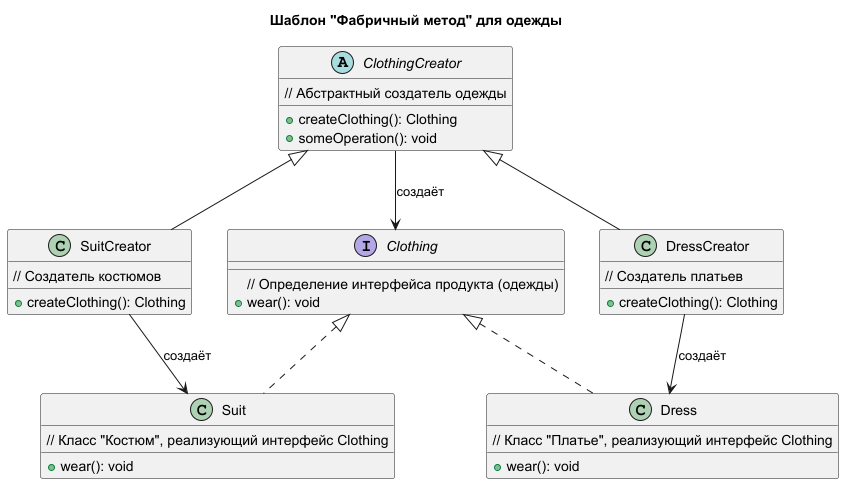

# Шаблон "Фабричный метод"

Шаблон "Фабричный метод" определяет интерфейс для создания объектов, но позволяет подклассам решать, какой класс
инстанцировать. Это позволяет делегировать создание объектов дочерним классам.

### Пример паттерна на react
https://www.npmjs.com/package/smetaniny-react-factory-method

## Что это такое?

Шаблон "Фабричный метод" используется для создания объектов, но вместо непосредственного создания объектов, создание
делегируется подклассам. Это позволяет сделать код более гибким и независимым от конкретных классов объектов, которые
нужно создавать.

## Когда использовать?

- Когда заранее неизвестно, какой именно объект необходимо создать.
- Когда нужно, чтобы создание объектов происходило в подклассах.
- Когда создание объектов является сложным процессом, и нужно контролировать этот процесс.

## Как это работает?

### Компоненты:

1. **Продукт:** Общий интерфейс для объектов, которые будут создаваться.
2. **Конкретный продукт:** Реализация интерфейса продукта, создаваемого фабричным методом.
3. **Создатель:** Класс, который определяет фабричный метод для создания объектов.
4. **Конкретный создатель:** Реализует фабричный метод, создавая конкретный продукт.

## Плюсы

- **Гибкость:** Упрощает добавление новых типов объектов без изменения существующего кода.
- **Расширяемость:** Позволяет подклассам решать, какой объект создавать, делая систему более модульной.
- **Ослабленная зависимость:** Убирает жесткую привязку к конкретным классам, что делает систему более устойчивой к
  изменениям.

## Минусы

- **Усложнение кода:** Требует создания подклассов для каждого нового типа продукта, что может сделать код более сложным
  и громоздким.
- **Избыточность:** В некоторых случаях применение шаблона может оказаться избыточным, если создание объектов не
  является сложным процессом.
- **Необходимость наследования:** Для изменения способа создания объектов нужно создавать новые подклассы, что может
  привести к росту количества классов.

## Участники

- **Clothing** - Одежда. Определяет интерфейс объектов, создаваемых фабричным методом (аналог **Product**).

- **Suit** - Костюм. Конкретный продукт, реализующий интерфейс `Clothing` (аналог **ConcreteProduct**).

- **Dress** - Платье. Конкретный продукт, также реализующий интерфейс `Clothing` (аналог **ConcreteProduct**).

- **ClothingCreator (методы: createClothing(), someOperation())** - Создатель одежды. Абстрактный класс, объявляющий
  фабричный метод для создания объектов одежды. В методе `createClothing()` возвращается объект типа `Clothing`. Это
  аналог **Creator**.

- **SuitCreator (методы: createClothing())** - Создатель костюмов. Конкретный создатель, переопределяющий фабричный
  метод и создающий объект типа `Suit` (аналог **ConcreteCreator**).

- **DressCreator (методы: createClothing())** - Создатель платьев. Конкретный создатель, переопределяющий фабричный
  метод и создающий объект типа `Dress` (аналог **ConcreteCreator**).

## Структура

## Отношения

Создатель одежды полагается на свои подклассы в определении фабричного метода, который возвращает экземпляр подходящего
продукта (костюм или платье).

## Применение паттерна "Фабричный метод" в интернет-магазине

Паттерн "Фабричный метод" может быть весьма полезен в контексте интернет-магазина, особенно при создании объектов,
которые имеют схожие характеристики, но могут отличаться по конкретным параметрам. Ниже приведены сценарии, где
применение данного паттерна может быть целесообразным.

### 1. Создание различных типов продуктов

**Сценарий:** В интернет-магазине могут продаваться разные типы продуктов, такие как одежда, электроника, мебель и т.д.
Каждый из этих типов может иметь свои уникальные характеристики, но общие операции (например, добавление в корзину,
оформление заказа и т.д.) могут быть схожи.

**Применение:** Используя "Фабричный метод", можно создать абстрактный класс `Product`, а затем конкретные классы, такие
как `ClothingProduct`, `ElectronicsProduct` и `FurnitureProduct`. Каждое из этих классов может реализовать свои
особенности, такие как уникальные способы расчета цены, налоги или скидки.

### 2. Выбор способов доставки

**Сценарий:** В интернет-магазине может быть несколько способов доставки, таких как курьерская служба, почта и
самовывоз. Каждый способ доставки может иметь свои уникальные параметры (например, стоимость, время доставки и т.д.).

**Применение:** Вы можете создать абстрактный класс `DeliveryMethod` и конкретные классы, такие
как `CourierDelivery`, `PostDelivery` и `PickupDelivery`. Фабричный метод позволит вам создавать объекты различных
способов доставки в зависимости от выбора пользователя.

### 3. Обработка платежей

**Сценарий:** Интернет-магазин может поддерживать несколько методов оплаты, таких как кредитные карты, PayPal,
криптовалюты и т.д. Каждый метод оплаты может иметь свои особенности, такие как обработка данных или комиссии.

**Применение:** Создайте абстрактный класс `PaymentMethod`, а затем конкретные классы, такие
как `CreditCardPayment`, `PayPalPayment` и `CryptoPayment`. Используя "Фабричный метод", вы можете легко добавлять новые
способы оплаты, не изменяя существующий код.

### 4. Генерация отчетов

**Сценарий:** В интернет-магазине может потребоваться генерация различных отчетов, таких как отчеты о продажах, запасах
и т.д. Каждый отчет может требовать различной логики и формата вывода.

**Применение:** Создайте абстрактный класс `Report`, а затем конкретные классы, такие
как `SalesReport`, `InventoryReport` и `CustomerReport`. Фабричный метод поможет создавать нужные типы отчетов в
зависимости от требований.

### 5. Создание пользовательского интерфейса

**Сценарий:** При разработке пользовательского интерфейса интернет-магазина могут быть различные компоненты, такие как
кнопки, формы и списки товаров, которые могут иметь разные стили и поведение.

**Применение:** Создайте абстрактный класс `UIComponent` с конкретными классами, такими как `Button`, `Form`
и `ProductList`. Фабричный метод будет использоваться для создания компонентов в зависимости от тематики или платформы (
например, мобильное приложение или веб-интерфейс).

### Заключение

Применение паттерна "Фабричный метод" в интернет-магазине позволяет создать более гибкую и расширяемую архитектуру. Он
упрощает добавление новых типов продуктов, способов доставки или методов оплаты без изменения существующего кода, что
значительно ускоряет процесс разработки и делает систему более устойчивой к изменениям.
