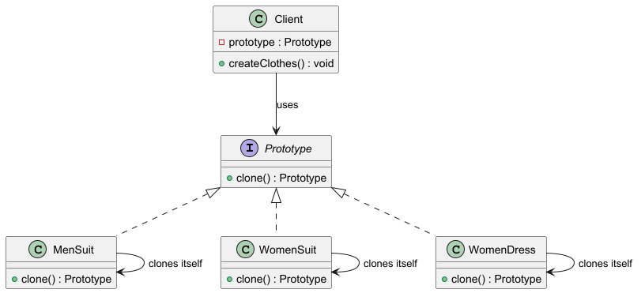

# Шаблон "Прототип" (Prototype)

Шаблон "Прототип" позволяет создавать новые объекты на основе существующих, копируя их. Это упрощает создание объектов,
особенно когда их создание может быть дорогостоящим или сложным.

### Пример паттерна на react

https://www.npmjs.com/package/smetaniny-react-prototype

## Что это такое?

Шаблон "Прототип" используется для создания новых объектов путем копирования существующих. Вместо создания объекта с
нуля, вы создаете его копию, что позволяет быстро создавать новые экземпляры с сохранением всех свойств оригинала.

## Когда использовать?

Используйте паттерн прототип, когда система не должна зависеть от того, как в ней создаются, компонуются и
представляются продукты, кроме
того

- классы для создания экземпляров определяются во время выполнения, например с помощью динамической загрузки.
    - Пример: Магазин, загружающий товары из разных источников (ручной ввод, сторонние API). Вы не знаете заранее, как
      именно будет создаваться товар, но вам нужно гибко работать с ним. Паттерн "Прототип" помогает абстрагироваться от
      способа создания товара, просто клонируя объекты.
- для того что бы избежать построения иерархий классов или фабрик, параллельных иерархии классов продуктов.
    - Пример: У вас есть сложная иерархия товаров в магазине (Одежда → Футболки, Электроника → Телефоны и т.д.).
      Паттерн "Прототип" позволяет вам не создавать отдельные фабрики для каждого типа товара. Вместо этого вы создаете
      базовый объект (футболка, телефон) и клонируете его, изменяя только необходимые параметры.
- экземпляры классов могут находится в одном из не очень большого числа различных состояний. Может быть удобнее
  установить соответствующее число прототипов и клонировать их, а не создавать экземпляр каждый раз в ручную в
  подходящем состоянии.
    - Пример: Если в магазине продаются футболки только фиксированных размеров и цветов, проще заранее создать прототипы
      этих товаров и клонировать их, когда нужно создать конкретный товар для пользователя. Это экономит время и
      ресурсы, так как объекты уже будут в нужном состоянии.

## Как это работает?

### Компоненты:

1. **Прототип:** Интерфейс или абстрактный класс, который объявляет метод для копирования самого себя.
2. **Конкретные прототипы:** Реализуют интерфейс прототипа и предоставляют метод копирования.
3. **Клиент:** Использует прототипы для создания новых объектов.

## Плюсы

- **Скорость создания:** Позволяет быстро создавать объекты, копируя уже существующие.
- **Гибкость:** Упрощает изменение объектов, поскольку их можно создать на основе других объектов.
- **Снижение связанности:** Уменьшает зависимость клиентского кода от конкретных классов.

## Минусы

- **Сложность реализации:** Копирование объектов может быть сложным, особенно если объекты содержат сложные структуры
  или ресурсы.
- **Проблемы с производительностью:** Копирование больших объектов может привести к потере производительности.
- **Проблемы с изменяемыми объектами:** Если копируемый объект изменяется после создания прототипа, это может привести к
  непредсказуемым последствиям.

## Участники

- **Prototype** - прототип. Объявляет интерфейс для клонирования самого себя.
- **ConcretePrototype1** - конкретный прототип.
- **ConcretePrototype2** - конкретный прототип.
- **Client** - создает новый объект, обращаясь к прототипу с запросом клонировать себя.

Клиент обращается к прототипу, тот создал свою копию

## Структура

