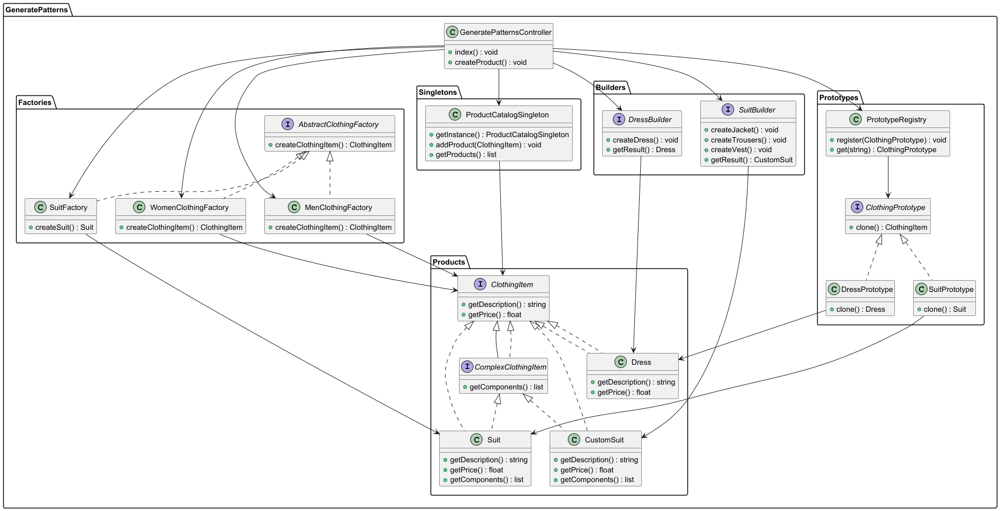

| Критерий                | **Шаблон "Строитель"**                                                                                                                                                                     | **Шаблон "Абстрактная Фабрика"**                                                                                                                                                                    | **Шаблон "Фабричный метод"**                                                                                                                                                            | **Шаблон "Singleton"**                                                                                                                                                                     | **Шаблон "Prototype"**                                                                                                                                                                     |
|-------------------------|--------------------------------------------------------------------------------------------------------------------------------------------------------------------------------------------|-----------------------------------------------------------------------------------------------------------------------------------------------------------------------------------------------------|-----------------------------------------------------------------------------------------------------------------------------------------------------------------------------------------|---------------------------------------------------------------------------------------------------------------------------------------------------------------------------------------------|---------------------------------------------------------------------------------------------------------------------------------------------------------------------------------------------|
| **Описание**            | Позволяет поэтапно создавать сложные объекты.                                                                                                                                              | Позволяет создавать семейства связанных объектов без указания их конкретных классов.                                                                                                                | Делегирует создание объектов подклассам.                                                                                                                                                | Гарантирует создание единственного экземпляра класса и предоставляет к нему глобальную точку доступа.                                                                                     | Позволяет копировать существующие объекты без зависимости от их классов.                                                                                                                   |
| **Когда использовать**  | - Когда объект состоит из множества частей. <br> - Когда необходимо создать разные представления одного и того же объекта.<br> - Когда нужно повторное использование алгоритма построения. | - Когда необходимо создавать семейства связанных объектов. <br> - Когда нужно избежать жесткой зависимости от конкретных классов.<br> - Когда требуется совместимость между продуктами в семействе. | - Когда заранее неизвестно, какой именно объект необходимо создать. <br> - Когда создание объектов является сложным процессом.<br> - Когда нужно делегировать инстанцирование объектов. | - Когда нужен только один экземпляр класса. <br> - Когда требуется контроль доступа к единственному экземпляру.                                                                             | - Когда необходимо создать копию существующего объекта или несколько его вариаций. <br> - Когда создание объекта трудоемкое или дорогостоящее.                                            |
| **Примеры применения**  | - Создание заказов, персонализация товаров, комплекты товаров. <br> - Создание домов, автомобилей, интерфейсов с множеством настроек.                                                      | - Создание интерфейсов для различных семейств продуктов (например, одежда, обувь и аксессуары).                                                                                                     | - Создание различных типов продуктов (одежда, электроника), способов доставки, методов оплаты.                                                                                          | - Менеджеры конфигурации, классы подключения к базам данных, файловым системам.<br> - Логирование событий.                                                                                  | - Клонирование объектов, например, в системах управления прототипами продуктов. <br> - Оптимизация производительности путем клонирования вместо создания с нуля.                          |
| **Цель**                | Пошаговое создание сложных объектов с возможностью изменения представления.                                                                                                                | Создание семейств связанных или зависимых объектов без указания их конкретных классов.                                                                                                              | Делегирование создания объектов подклассам, позволяя изменять создаваемые объекты.                                                                                                      | Обеспечение существования только одного экземпляра объекта, к которому можно получить доступ из любой точки программы.                                                                    | Создание новых объектов на основе существующих, минимизируя зависимости от их классов.                                                                                                     |
| **Процесс**             | Процесс создания объекта разбивается на несколько шагов, которые управляются директором.                                                                                                   | Клиентский код работает с интерфейсом, абстрактная фабрика создает конкретные продукты. Клиент не зависит от конкретных классов.                                                                    | Создатель определяет фабричный метод, который возвращает объект нужного типа. Каждый подкласс создателя реализует свою логику.                                                          | Класс предоставляет метод для доступа к единственному экземпляру и гарантирует, что ни один другой экземпляр не будет создан.                                                             | Объект создает свои копии с использованием встроенного механизма клонирования (например, метод `clone` в Java или `__clone__` в PHP).                                                     |
| **Возвращаемый объект** | Сложный объект.                                                                                                                                                                            | Семейство связанных объектов.                                                                                                                                                                       | Конкретный продукт.                                                                                                                                                                     | Единственный экземпляр объекта.                                                                                                                                                            | Копия существующего объекта.                                                                                                                                                               |
| **Гибкость**            | Высокая, позволяет создавать различные представления одного и того же объекта. Позволяет изменять отдельные шаги построения.                                                               | Высокая, позволяет легко добавлять новые семейства продуктов. Однако добавление продуктов в существующие семейства может потребовать изменения интерфейсов.                                         | Средняя, упрощает добавление новых типов продуктов, но требует создания новых подклассов для каждого типа.                                                                              | Низкая, так как существует только один экземпляр объекта.                                                                                                                                 | Высокая, так как позволяет клонировать объекты с различными настройками без зависимости от классов.                                                                                       |
| **Структура объектов**  | Включает строителя, директора и продукт.                                                                                                                                                   | Включает интерфейсы для фабрики и конкретные классы продуктов.                                                                                                                                      | Включает абстрактного создателя и конкретных создателей.                                                                                                                                | Включает класс с методом, который возвращает единственный экземпляр.                                                                                                                       | Включает интерфейс для клонирования и классы объектов, которые могут быть клонированы.                                                                                                    |
| **Сложность**           | Средняя, требует создания множества классов.                                                                                                                                               | Высокая, требует больше абстракции и конфигурации.                                                                                                                                                  | Низкая, но может стать громоздкой с увеличением количества подклассов.                                                                                                                  | Низкая, но может усложняться реализация многопоточности или распределенных систем, где требуется гарантировать единственность экземпляра.                                                  | Низкая, но требует осторожности при клонировании сложных объектов, содержащих ссылки на другие объекты (глубокое и поверхностное копирование).                                            |
| **Недостатки**          | Множество классов для каждого конкретного случая, что может увеличивать сложность.                                                                                                         | Может быть сложно добавить новые продукты в существующие семейства, если потребуется менять интерфейсы.                                                                                             | Для каждого нового типа продукта нужно создавать новый подкласс, что может усложнять поддержку проекта.                                                                                 | Может создавать проблемы с тестированием и расширением функционала. В многопоточных системах необходимо обеспечить корректное управление доступом к единственному экземпляру.               | Может возникнуть необходимость в реализации глубокого копирования, что увеличивает сложность клонирования объектов с большим количеством зависимостей и связей.                            |


Чтобы сделать полный пример, включающий все порождающие паттерны (Абстрактная фабрика, Фабричный метод, Строитель, Прототип и Синглтон), мы расширим структуру проекта, добавив соответствующие паттерны. Структура будет построена таким образом, чтобы легко масштабироваться, добавлять новые категории одежды и новые типы продуктов, сохраняя при этом гибкость и модульность.


## Структура



```php
/**
 * Контроллер для демонстрации паттернов (Абстрактная фабрика, Абстрактный метод,
 * Строитель, Прототип, Синглтон) на основе URL фильтров.
 *
 * Этот контроллер разбирает входящий URL, чтобы определить, какой тип одежды создать
 * (например, костюм или платье), и использует соответствующую фабрику или строителя
 * для создания объекта одежды.
 *
 * @author Smetanin Sergey
 */
class GeneratePatternsController
{
    /**
     * Основной метод, который демонстрирует использование паттернов проектирования.
     *
     * Этот метод разбирает URL, выбирает нужную фабрику (для мужчин или женщин)
     * и создает либо костюм с использованием строителя, либо платье с использованием фабрики.
     *
     * Используемые паттерны:
     * - Абстрактная фабрика для создания одежды
     * - Строитель для создания компонентов костюма
     * - Прототип может использоваться для клонирования объектов (если необходимо)
     * - Синглтон для управления доступом к каталогу продуктов
     */
    public function index(): void
    {
        $segments = explode('/', trim('catalog/женщинам/платье/', '/'));

        $filters = [
            'gender' => $segments[1],
            'clothingType' => $segments[2]
        ];

        if ($filters['gender'] === 'женщинам') {
            $factory = new WomenClothingFactory();
        } else {
            $factory = new MenClothingFactory();
        }

        if ($filters['clothingType'] === 'костюм') {
            $builder = new SuitBuilder();
            $builder->createJacket();
            $builder->createTrousers();
            $builder->createVest();
            $product = $builder->getResult();
        } else {
            // Создаем базовое платье
            $dress = $factory->createClothingItem('платье');

            // Используем прототип для клонирования платья
            $dressPrototype = new DressPrototype($dress);
            $clonedDress = $dressPrototype->clone();

            // Изменяем некоторые атрибуты клонированного платья
            $clonedDress->setPrice(3978); // Устанавливаем новую цену для клона

            // Выводим описание и цену созданного продукта
            echo 'Описание оригинального платья: ' . $dress->getDescription() . "\n";
            echo 'Цена оригинального платья: ' . $dress->getPrice() . " руб.\n";

            echo 'Описание клонированного платья: ' . $clonedDress->getDescription() . "\n";
            echo 'Цена клонированного платья: ' . $clonedDress->getPrice() . " руб.\n";
        }
    }
}
```
