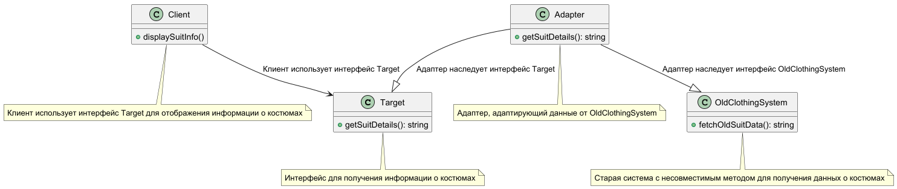

# Шаблон "Адаптер"

Шаблон "Адаптер" преобразует интерфейс класса в другой интерфейс, ожидаемый клиентами. Он обеспечивает совместную работу
классов, которая была бы невозможна без данного паттерна из-за несовместимости интерфейсов.

### Пример паттерна на react

https://www.npmjs.com/package/smetaniny-react-adapter-class

## Что это такое?

Шаблон "Адаптер" позволяет объектам с несовместимыми интерфейсами работать вместе. Он выступает в роли моста между двумя
несовместимыми интерфейсами, преобразуя вызовы методов одного интерфейса в вызовы методов другого.

## Как это работает?

### Компоненты:

1. **Целевой интерфейс:** Определяет интерфейс, который ожидают клиенты.
2. **Адаптируемый класс:** Класс, интерфейс которого нужно адаптировать.
3. **Адаптер:** Переводит вызовы из целевого интерфейса в интерфейс адаптируемого класса.

## Плюсы

- **Интеграция старого и нового кода:** Позволяет легко интегрировать существующие классы с новыми, минимизируя
  изменения в коде.
- **Упрощение работы со сторонними библиотеками:** Облегчает использование библиотек с несовместимыми интерфейсами.
- **Снижение связности:** Уменьшает зависимость между классами, что улучшает читаемость и поддержку кода.

## Минусы

- **Дополнительная сложность:** Введение адаптера может сделать архитектуру сложнее, добавляя дополнительные уровни.
- **Потенциальная потеря производительности:** Каждый вызов метода проходит через адаптер, что может снизить
  производительность в некоторых случаях.
- **Трудности отладки:** Из-за дополнительного уровня абстракции может быть сложнее отлаживать код.

## Почему это полезно?

- Позволяет интегрировать старый и новый код без значительных изменений.
- Упрощает использование сторонних библиотек и компонентов.
- Снижает связность между классами, улучшая читаемость и поддержку кода.

## Когда использовать?

- Когда вам нужно использовать уже существующий класс, но его интерфейс не соответствует вашим требованиям.
- Необходимо создать класс, который может повторно использоваться и взаимодействовать с классами, интерфейсы которых
  заранее неизвестны или не совместимы с ним.
- (только для адаптеров объектов!) Вам нужно использовать несколько существующих подклассов, но создавать новые
  подклассы для каждого из них нецелесообразно. В этом случае адаптер объектов может настроить интерфейс, основываясь на
  общем родительском классе.

## Когда использовать Class Adapter

**Когда использовать**:

- Когда у вас есть доступ к исходному коду старой системы, и вы можете использовать наследование.
- Когда нужно адаптировать несовместимые интерфейсы через множественное наследование.

**Пример**: Старая система управления мужскими костюмами имеет несовместимый интерфейс для получения информации о
товаре. Используйте **Class Adapter**, чтобы наследовать этот класс и адаптировать его под новый интерфейс отображения
костюмов.

---

Использование этих паттернов позволяет интегрировать старые системы или внешние сервисы в новый интернет-магазин с
минимальными изменениями кода.

## Структура

- **ClassAdapter** Адаптер класса использует множественное наследование для адаптации одного интерфейса к другому.

# Участники

- **Target** - целевой. Определяет зависящий от предметной области интерфейс, которым пользуется Client.
- **Client** - клиент. Вступают во взаимоотношения с объектами, удовлетворяющими интерфейсу Target/
- **Adaptee** - адаптируемый. Определяет существующий интерфейс, который нуждается в адаптации.
- **Adapter** - адаптер. адаптирует интерфейс Adaptee к интерфейсу Target 
