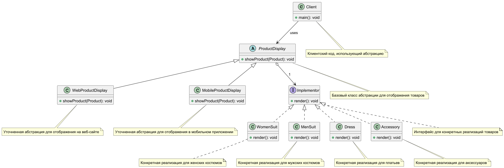

# Шаблон "Мост"

Шаблон "Мост" разделяет абстракцию и реализацию, позволяя им изменяться независимо друг от друга. Это помогает избежать
жесткой привязки между абстракцией и реализацией и делает систему более гибкой.

### Пример паттерна на react

https://www.npmjs.com/package/smetaniny-react-bridge

## Что это такое?

Шаблон "Мост" позволяет разделить интерфейс (абстракцию) от его реализации, что дает возможность изменять обе стороны
независимо. Это полезно, когда у вас есть множество различных реализаций, которые могут изменяться без изменения кода,
использующего эти реализации.

## Как это работает?

### Компоненты:

1. **Абстракция:** Определяет интерфейс и содержит ссылку на объект реализации.
2. **Расширенная абстракция:** Реализует дополнительные функции, используя реализацию.
3. **Реализация:** Определяет интерфейс для конкретной реализации.
4. **Конкретная реализация:** Реализует методы интерфейса реализации.

## Плюсы

- **Гибкость:** Позволяет изменять абстракцию и реализацию независимо, что упрощает управление кодом.
- **Легкость в добавлении новых реализаций:** Новые реализации можно добавлять без изменения существующего кода, что
  улучшает поддержку.
- **Упрощает масштабируемость:** Позволяет легко расширять систему, добавляя новые функции или реализации.

## Минусы

- **Сложность реализации:** Структура становится более сложной из-за введения дополнительных уровней абстракции.
- **Увеличение количества классов:** Может потребоваться создать много классов для реализации абстракций и их
  реализаций, что усложняет код.
- **Необходимость в понимании:** Потребуется больше времени на изучение шаблона для разработчиков, не знакомых с ним.

## Почему это полезно?

- Упрощает добавление новых реализаций и абстракций.
- Улучшает поддержку и расширяемость кода.
- Позволяет легко изменять реализацию без необходимости изменять клиентский код.

## Когда использовать?

- **Изменяемая реализация:** Когда нужно, чтобы реализация (конкретные детали работы) могла меняться во время выполнения
  программы. Например, если у вас есть разные способы обработки данных, и вы хотите выбирать между ними по мере
  необходимости.
- **Расширяемые абстракции и реализации:** Если у вас есть множество абстракций (например, различные типы форм) и
  множество
  реализаций (например, различные способы рисования форм), и вы хотите добавлять новые типы форм и способы их рисования,
  не создавая слишком много классов. Паттерн "Мост" позволяет комбинировать разные типы и способы без усложнения
  структуры.
- **Скрытие изменений:** Если изменения в реализации не должны влиять на клиентский код, т.е. код, который использует
  вашу
  абстракцию, не должен меняться и перекомпилироваться при изменении реализации. Это позволяет делать обновления более
  гибкими.
- **Скрытие реализации в C++:** В C++ важно полностью скрыть детали реализации от клиента, так как детали класса могут
  быть
  видны в его интерфейсе. Паттерн "Мост" помогает это сделать, отделяя интерфейс от реализации.
- **Избыток классов:** Если у вас слишком много классов из-за сложной иерархии, это может быть признаком того, что стоит
  разделить абстракцию и реализацию, чтобы упростить структуру классов и сделать её более управляемой.
- **Совместное использование реализации:** Если одна и та же реализация должна использоваться несколькими объектами, но
  клиент не должен об этом знать, паттерн "Мост" позволяет скрыть этот факт, обеспечивая чистый интерфейс.

В целом, паттерн "Мост" помогает сделать код более гибким, модульным и удобным для расширения, позволяя разрабатывать
сложные системы, не усложняя их структуру.

## Структура

- **Abstraction** - абстракция. Определяет интерфейс абстракции. Хранит ссылку на объект типа Implementor.
- **RefinedAbstraction** - уточненная абстракция. Расширяет интерфейс, определенный абстракцией Abstraction.
- **Implementor** - реализатор. Определяет интерфейс для классов реализации. Он не обязан точно соответствовать
  интерфейсу класса Abstraction. На самом деле оба интерфейса могут быть совершенно различны. Обычно интерфейс класса
  Implementor предоставляет только примитивные операции, а класс Abstraction определяет операции более высокого уровня,
  основанные на этих примитивах.
- ConcreteImplementor - Конкретный реализатор. Реализует интерфейс класса Implementor и определяет его конкретную
  реализацию.

Объект Abstraction перенаправляет запросы клиента своему объекту Implementor.

## Пример
Интернет-магазин продает разнообразную одежду, которая может быть разделена на множество категорий: женская и мужская
одежда, платья, костюмы, аксессуары и т.д. Для каждой категории может потребоваться отображение товара по-разному, в
зависимости от устройства или платформы (мобильное приложение, веб-сайт, терминал в магазине). Также могут быть разные
вариации отображения и представления товаров в зависимости от типа клиента (оптовый покупатель, розничный покупатель).

## Структура

