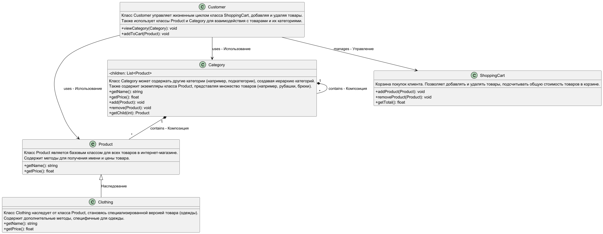

# Шаблон "Компоновщик"

Шаблон "Компоновщик" позволяет организовать объекты в древовидную структуру для представления иерархий "часть-целое". Он
позволяет клиентам работать с отдельными объектами и их композициями единообразно.

### Пример паттерна на react

https://www.npmjs.com/package/smetaniny-react-composite

## Что это такое?

Шаблон "Компоновщик" используется для того, чтобы сгруппировать объекты в виде дерева, где каждый узел может быть как
отдельным объектом, так и контейнером для других объектов. Это упрощает работу с составными структурами, так как
операции, применимые к одиночным объектам, могут применяться и к целым группам объектов.

## Когда использовать?

- Когда объекты можно представить в виде древовидной структуры "часть-целое".
- Когда нужно, чтобы клиентский код одинаково работал как с отдельными объектами, так и с их группами.
- Когда нужно динамически строить иерархии объектов.

## Как это работает?

### Компоненты:

1. **Компонент:** Общий интерфейс для как одиночных объектов, так и их композиций.
2. **Лист:** Представляет отдельные объекты, которые не содержат других объектов.
3. **Контейнер (Композит):** Хранит другие объекты (листья или другие контейнеры) и реализует операции, которые могут
   быть выполнены на этих объектах.
4. **Клиент:** Работает с объектами через интерфейс компонента, не зная, является ли объект листом или композитом.

## Плюсы

- **Единообразие:** Клиенты могут работать с отдельными объектами и их группами через один и тот же интерфейс.
- **Простота управления сложными структурами:** Упрощает работу с иерархиями объектов, позволяет легко изменять и
  расширять структуру.
- **Гибкость:** Легко добавлять новые типы компонентов (листьев и контейнеров) без изменения клиентского кода.

## Минусы

- **Сложность отладки:** Глубокие иерархии могут усложнить отладку и отслеживание ошибок.
- **Переусложнение:** Использование "Компоновщика" может привести к чрезмерному усложнению системы, если структура
  объектов не требует сложной иерархии.
- **Может ухудшить производительность:** Работа с большими и сложными композициями может привести к замедлению системы
  из-за необходимости обхода дерева объектов.

## Почему это полезно?

- Позволяет работать с объектами и их композициями единообразно.
- Упрощает управление сложными иерархиями объектов.
- Делает код гибким для добавления новых типов объектов и их структур.

## Участники

- **Component (Товар)** — базовый интерфейс для всех товаров. Может быть как отдельным товаром (например, футболка), так
  и категорией товаров (например, "Одежда").
- **Leaf (Товар)** — представляет конкретный товар, например, футболку или джинсы. Не имеет потомков.
- **Composite (Категория)** — представляет категорию или подкатегорию товаров, которая может содержать как отдельные
  товары, так и другие категории. Например, категория "Одежда" может содержать подкатегории "Футболки", "Джинсы" и т.д.
- **Client (Клиент)** — взаимодействует с товарами и категориями, добавляет товары в корзину и просматривает их.

## Отношения

Клиенты используют интерфейс класса Component для взаимодействия с объектами в составной структуре. Если получателем
запроса является листовой объект Leaf, то он и обрабатывает запрос. Когда же получателем является составной объект
Composite, то обычно он перенаправляет запрос своим потомкам - возможно, с выполнением некоторых дополнительных операций
до или после перенаправления.

### Паттерн "Компоновщик" может быть использован в различных ситуациях, включая:

1. **Иерархия категорий товаров**:
    - Организация моделей категорий и подкатегорий с использованием реляционных связей в базе данных.

2. **Композиция товаров**:
    - Создание составных товаров, таких как наборы, с помощью полиморфных отношений в Eloquent.

3. **Расширяемые системы фильтров**:
    - Реализация многоуровневых фильтров в контроллерах, которые обрабатывают запросы от пользователя и возвращают
      соответствующие товары.

4. **Отображение списков товаров**:
    - Использование Blade-шаблонов для отображения как простых товаров, так и групп товаров в виде единого списка.

5. **Адаптивные интерфейсы**:
    - Реализация маршрутов и контроллеров, которые обрабатывают разные представления для отдельных и групповых товаров.

6. **Корзина покупок**:
    - Создание модели для корзины, где можно добавлять как отдельные товары, так и группы товаров.

7. **Управление акциями и скидками**:
    - Применение акций на уровне категорий с помощью Eloquent-отношений.

8. **Создание отчетов и анализа**:
    - Формирование отчетов по продажам на уровне категорий и товаров с использованием запросов к базе данных.

## Структура

