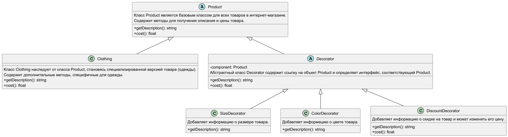

# Шаблон "Декоратор"

Шаблон "Декоратор" динамически добавляет новую функциональность объекту, оборачивая его в другой объект. Это позволяет
расширять возможности объекта без изменения его кода.

### Пример паттерна на react

https://www.npmjs.com/package/smetaniny-react-decorator

## Что это такое?

Шаблон "Декоратор" позволяет добавлять объектам новые обязанности или функциональность, не изменяя их исходный класс.
Это делается путем создания "обертки" (декоратора), который добавляет новые функции, сохраняя при этом интерфейс
оригинального объекта.

## Как это работает?

### Компоненты:

1. **Компонент:** Общий интерфейс для объектов, которые могут быть декорированы.
2. **Конкретный компонент:** Объект, который будет декорироваться.
3. **Декоратор:** Класс, который реализует интерфейс компонента и содержит ссылку на объект компонента.
4. **Конкретный декоратор:** Добавляет конкретные обязанности объекту, сохраняя его интерфейс.

## Плюсы

- **Гибкость:** Позволяет динамически добавлять новую функциональность объектам без изменения их кода.
- **Меньшая зависимость от наследования:** Избегает создания большого количества подклассов для каждой новой комбинации
  функций.
- **Простота комбинации:** Позволяет комбинировать несколько декораторов для добавления различных функций.

## Минусы

- **Усложнение структуры:** Множество вложенных декораторов может сделать код сложным для понимания и отладки.
- **Трудности при создании новых объектов:** Из-за необходимости "оборачивать" объект в несколько декораторов, создание
  объекта может стать менее интуитивным.
- **Нарушение принципа единственной ответственности:** Декораторы могут становиться многозадачными, добавляя сразу
  несколько функций объекту, что усложняет поддержку.

## Почему это полезно?

- Позволяет гибко и динамично добавлять функциональность объектам.
- Избегает создания большого количества подклассов для каждой комбинации возможных функций.
- Сохраняет оригинальные объекты неизменными, добавляя новые возможности через декораторы.

## Когда использовать?

- **Динамическое добавление обязанностей:** - Если вам нужно добавить новые функции или характеристики к объектам без
  изменения их основной структуры и без влияния на другие объекты, декоратор — отличное решение. Например, в
  интернет-магазине одежды можно добавить различные опции к товару, такие как "скидка" или "акция", без необходимости
  менять сам товар.
- **Снятие обязанностей:** - Декораторы позволяют не только добавлять, но и убирать функции с объектов. Например, если у
  вас есть товар с определенной характеристикой (например, "в наличии"), вы можете создать декоратор, который уберет эту
  характеристику, когда товар больше не доступен
- **Проблемы с наследованием:** - Иногда создание новых подклассов (то есть расширение класса для добавления новых
  функций) становится сложным или невозможно. Это может произойти, когда у вас много разных функций, которые нужно
  комбинировать. В таком случае, вместо создания множества подклассов для каждой комбинации, лучше использовать
  декораторы. Это упростит структуру вашего кода и сделает его более гибким.

## Участники

- **Component** - определяет интерфейс для объектов, на которые могут динамически возложены дополнительные обязанности.
- **ConcreteComponent** - определяет объект, на который возлагаются дополнительные обязанности.
- **Decorator** - хранит ссылку на объект Component и определяет интерфейс, соответствующий интерфейсу Component.
- **ConcreteDecorator** - возлагает дополнительные обязанности на компонент.

## Отношения

Decorator переадресует запросы объекту Component. Может выполнить и дополнительные операции до и после переадресации.

## Структура

## Примеры использования паттерна "Декоратор" в проекте интернет-магазина

### 1. Расширение характеристик товара

В интернет-магазине на Laravel можно использовать декоратор для добавления характеристик к товарам. Например:

- **Размер**: Создание декоратора `SizeDecorator`, который добавляет информацию о размере одежды к товару. Это может
  включать различные размеры, такие как S, M, L и т.д.

- **Цвет**: Декоратор `ColorDecorator`, который добавляет информацию о цвете товара. Это позволяет динамически изменять
  цвет товара, не создавая новые классы.

### 2. Применение скидок

С помощью декоратора `DiscountDecorator` можно добавлять информацию о скидке на товар. Например, если у товара есть
базовая цена, этот декоратор может изменять цену, чтобы отразить скидку, и добавлять соответствующее сообщение о скидке
в описание товара.

### 3. Гибкость в модификации

Если в будущем появятся новые характеристики (например, бренд или материал), их можно легко добавить с помощью новых
декораторов, не меняя существующий код товаров.
